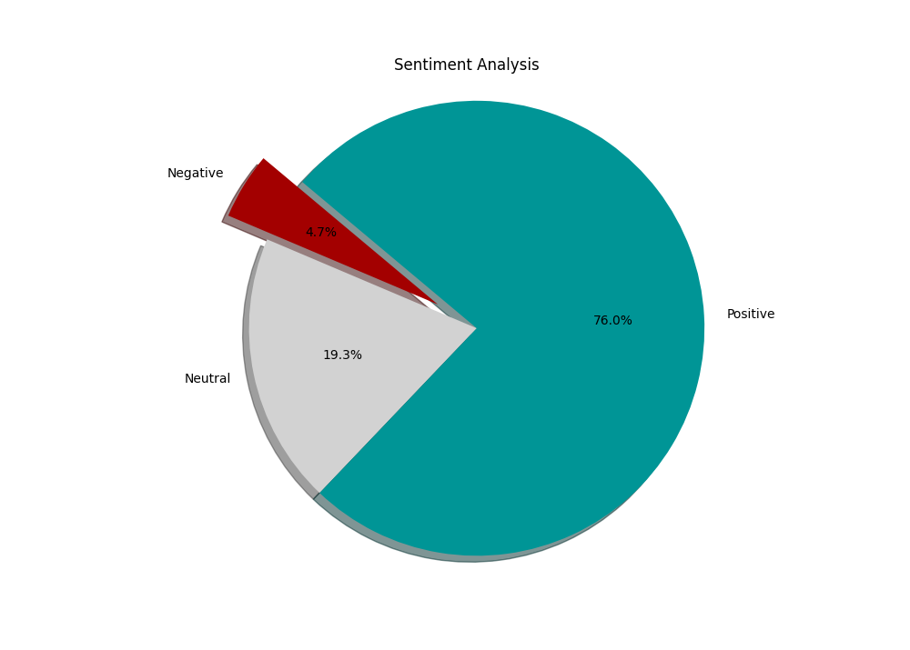
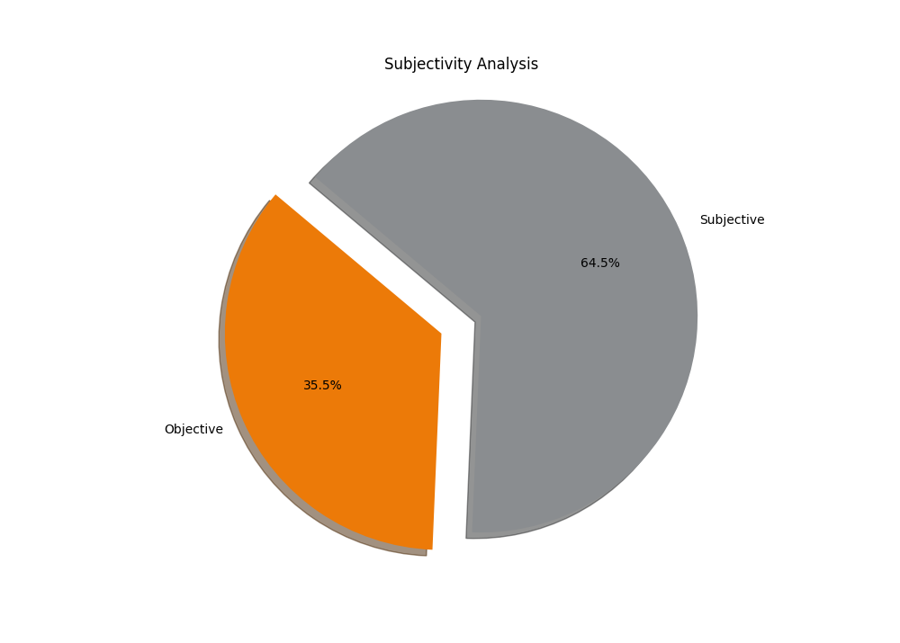

# Sentiment Analysis and Subjectivity Detection

## Overview

This project aims to analyze the sentiment of Amazon food reviews using various natural language processing (NLP) techniques. Three different sentiment analysis methods are employed: TextBlob, BERT transformers, and VADER.

## Data Source

The data used for sentiment analysis is sourced from the Amazon food review dataset available on Kaggle. You can access the dataset [here](https://www.kaggle.com/datasets/satyabrat35/amazon-food-review-dataset).

## Sentiment Analysis Methods

### TextBlob

TextBlob is a simple NLP library that provides tools for text processing tasks such as part-of-speech tagging, noun phrase extraction, and sentiment analysis.

### BERT Transformers

BERT (Bidirectional Encoder Representations from Transformers) is a transformer-based machine learning model for natural language understanding.

### VADER (Valence Aware Dictionary and sEntiment Reasoner)

VADER is a lexicon and rule-based sentiment analysis tool that is specifically attuned to sentiments expressed in social media.

## How to Use

1. **Data Preparation**: Ensure your Amazon food review data is in a compatible format (.txt or .csv).
2. **Choose Method**: Decide which sentiment analysis method you want to use: TextBlob, BERT transformers, or VADER.
3. **Run Code**: Execute the corresponding code block for the chosen method by providing the file path to your review data.
4. **View Results**: Analyzed sentiment results will be displayed in the form of pie charts, indicating the distribution of sentiments (negative, neutral, positive) or subjectivity (objective, subjective) in the reviews.

## Dependencies

Ensure you have the following dependencies installed in your Python environment:

- textblob==0.18.0.post0
- transformers==4.35.2
- torch==2.1.2
- vaderSentiment==3.3.2
- pandas==1.5.3
- matplotlib==3.8.2
- numpy==1.23.5

## Results

Below are the pie charts showing the analysis results:

### Sentiment Analysis

### Subjectivity Analysis

## Note

- For BERT transformers, the code utilizes a pre-trained sentiment analysis model (`textattack/bert-base-uncased-imdb`). You may need to install this model using the Hugging Face `transformers` library.
- If you encounter any issues or errors, please refer to the respective error messages and ensure your data is correctly formatted and accessible.
